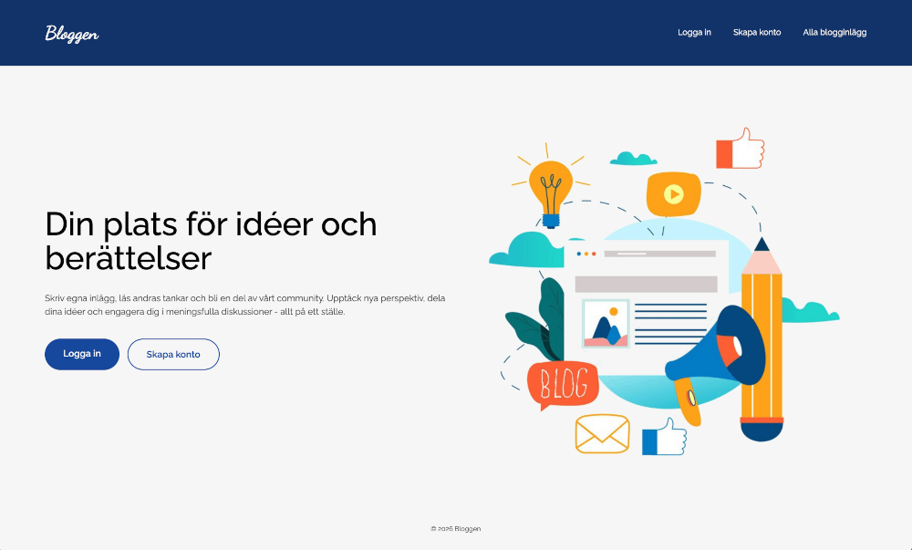

# Node.js Blog API med frontend

Ett fullstack Blog API byggt med **Node.js**, **Express**, **PostgreSQL** och en enkel frontend med **HTML/CSS/JS**.
Projektet inkluderar användarautentisering, registrering, CRUD-operationer för inlägg, kommentarer, likes/dislikes och en startsida med hero-sektion.



---

## Öppna sidan
Klicka på länken nedan för att öppna sidan (högerklicka för ny flik).

[Öppna sidan](https://selmacodes.github.io/blog-api/)

---

## Backend-funktioner
- Registrering och inloggning av användare
- Skapa, läsa, uppdatera och ta bort blogginlägg
- Gilla och ogilla inlägg
- Kommentera på inlägg
- Input-validering för strängar och nummer
- Ägarskapskontroller (användare kan endast ändra sina egna inlägg)

## Frontend-funktioner
- Startsida med hero-sektion och call-to-action
- Registrera nytt konto
- Logga in och logga ut
- Visa alla blogginlägg dynamiskt
- Dynamisk rendering av inlägg via fetch
- Grundläggande styling med flexbox

---

## Installation

### 1. Kloning av repot
```bash
git clone <repo-url>
cd <repo-folder>
```

### 2. Installera beroenden
```bash
npm install
```

### 3. Skapa `.env`-fil
Skapa en fil `.env` i root-mappen med PostgreSQL-konfiguration:
```env
DB_HOST=localhost
DB_PORT=5432
DB_NAME=blogdb
DB_USER=your_username
DB_PASSWORD=your_password
APP_PORT=3000
```

### 4. Skapa databasen
```sql
CREATE DATABASE blogdb;
```

### 5. Starta servern och öppna frontend
1. Kör servern från projektets rotmapp:

```bash
node src/app.mjs
```
Servern körs på porten som anges i `.env` (t.ex. http://localhost:3000)

2. Öppna `index.html` i webbläsaren (t.ex. via Live Server i VS Code) för att se startsidan och layouten.
 
 **OBS:** För full funktionalitet (registrera/logga in och hämta blogginlägg) måste servern köras. Se också till att porten i `.env` matchar URL:en i frontendens `fetch`-anrop (t.ex. `http://localhost:3000/api/...`).

---

## Struktur
- `routes/`       - alla endpoints
- `middlewares/`  - validering, autentisering, ägarskap
- `repositories/` - databaslogik
- `config/`       - databasanslutning och setup
- `index.html`    - startsidan (hero + CTA)
- `posts.html`    - sida som visar alla blogginlägg
- `login.html`    - inloggningssida
- `register.html` - registreringssida
- `styles.css`    - global styling
- `index.js`, `login.js`, `register.js` - frontend JS

---

## API Endpoints

### Users
- `POST /users`                      - Registrera ny användare

### Posts
- `POST /posts`                      - Skapa nytt inlägg (kräver inloggning)
- `GET /posts`                       - Hämta alla inlägg
- `GET /posts/search?title=<string>` - Hämta inlägg via titel
- `GET /posts/:id`                   - Hämta ett inlägg via ID
- `PATCH /posts/:id/like`            - Gilla ett inlägg
- `PATCH /posts/:id/dislike`         - Ogilla ett inlägg
- `PUT /posts/:id`                   - Uppdatera ett helt inlägg (kräver ägarskap)
- `PATCH /posts/:id/title`           - Uppdatera endast titel (kräver ägarskap)
- `DELETE /posts/:id`                - Ta bort ett inlägg (kräver ägarskap)

### Comments
- `POST /posts/:id/comments`         - Skapa en kommentar på ett inlägg (kräver inloggning)

---

## Tekniker
- Node.js
- Express
- PostgreSQL
- HTML, CSS, JavaScript
- Dynamisk rendering via fetch
- Flexbox för layout
- Middleware för validering, autentisering och ägarskap
- RESTful API-design

---

## Lärdomar

- Strukturera Node.js-projekt med `routes`, `middlewares` och `repositories`
- Använd middleware för validering och ägarskapskontroll för återanvändarbar kod
- Skydda endpoints med autentisering och kontrollera ägarskap
- Skapa Postgres-tabeller med relationer och `ON DELETE CASCADE`
- Validera `req.body`, `req.query` och `req.params` för robust API
- Reflektera över kodförbättringar och minska repetition
- Bygga frontend som kommunicerar med REST API via fetch
- Skapa dynamiska sidor som uppdateras när data ändras
- Implementera grundläggande användarautentisering på klienten
- Organisera frontend-filer och separera logik för olika sidor